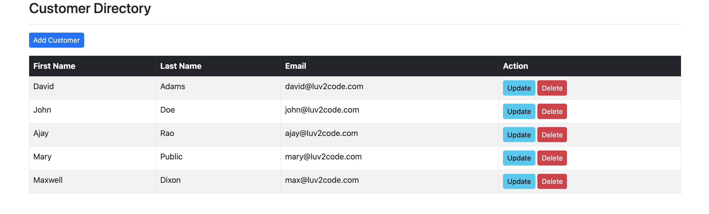

The website supports CRUD customers:

1. What is Spring MVC? 

Spring MVC is a framework to develop model-view-control relationship specific to web app. Model stands for data model (customer in this case). View stands for an html web page. Controller stands for a java method used to handle HTTP requests.    

2. What is Jackson? 

Jackson maps a Json object to a Java object. 

3. What is Thymeleaf?

Thymeleaf is used to generate HTML templates for Spring projects.

4. What is Hibernate (entity layer)?

Hibernate is a framework which maps java classes (called entities) to tables in relational database. Developers can use provided API to write queries and get results from the database. The connection pool size to the database can be configured in `application.properties` file.  

5. What is Spring data (DAO layer)? 

Spring data provides API to execute common queries on Hibernate entities. For example, `findAll()` selects all the records of the entity in database. Additionally, it provides free controllers for these API, which can be disabled in `application.properties` file. 

6. What is the service layer? 

Developers can define business logic using transactions in the service layer. This typically involves multiple queries execution. 

7. What is `@Transactional` annotation? 

`@Transactional` indicates a transaction starts. It corresponds to `Begin Transcation` statement in SQL. 

