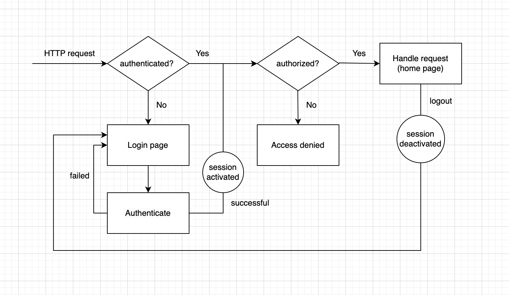

To play with the project, simply go to the login page and use (`john`, `test123`) and (`mary`, `test123`) to authenticate separately.

1. What is spring security?

Spring security is a spring framework to provide authentication and authorization for the web application.

2. What are the ways of authentication for web app?

Username/password, token, OAuth2, etc. In this project, we are using username and password for authentication.

3. What is a session?

A session is activated when users successfully login using username and password. In later requests, the web browser will cover it automatically so web server recognizes it and don't ask users to repeatedly authenticate. Sessions can be configured in spring security.

4. What is Cross-Site Request Forgery (CSRF)?

When a user authenticates successfully in one website A and browses another malicious website B, the website B may trick the user to send requests to the website A using the current session.

5. What is a CSRF token?

CSRF token is used to solve the CSRF attack problem. When a user authenticates successfully with the web server, the web server sends a CSRF token to the user, and the user must include the token in any form submission request later. Since browsers don't include CSRF token automatically in requests, it is much harder for attackers to get it and put it in malicious requests. Spring security and Thymeleaf handles CSRF token sending and receiving automatically, so developers don't need to be aware of it.

6. What is the flow for login?

For authentication, the framework checks the database to see if a username matches with a password

For authorization, the framework checks the database to see if a username has a certain role

7. What is bcrypt?

It is a one-way hashing technique, which means there is no way to decrypts the password. Additionally, spring security framework prevents brute force attacks on decrypting password.  
